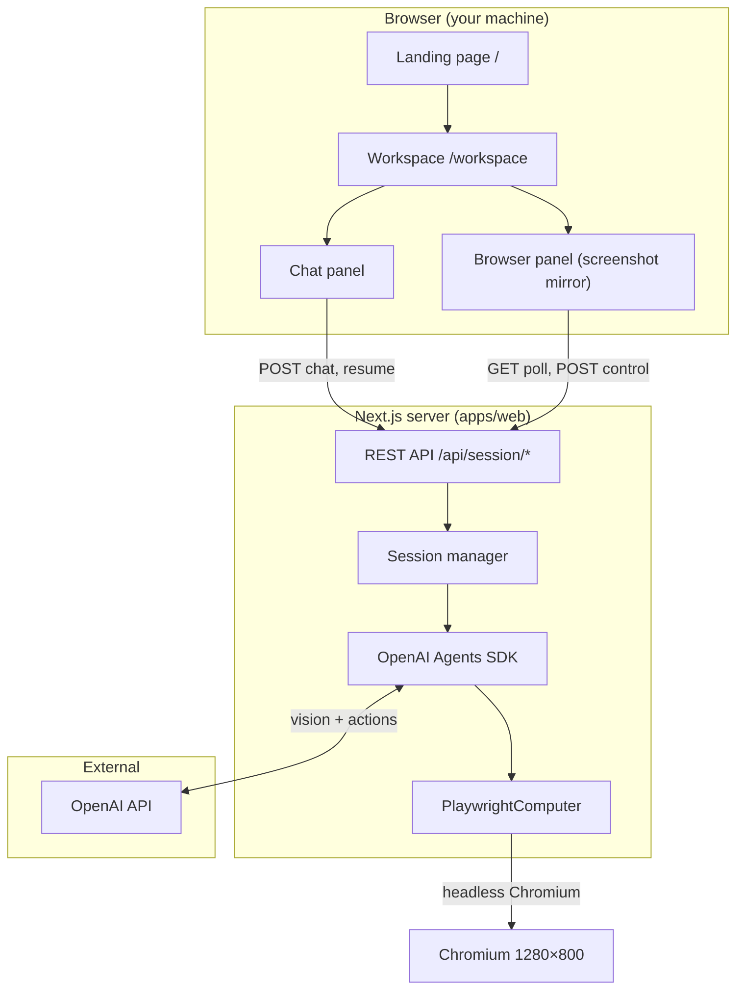
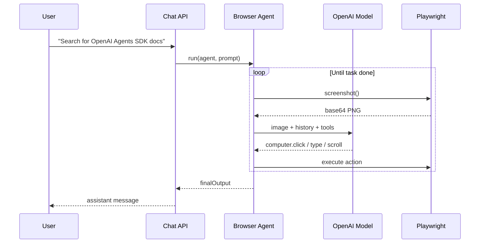
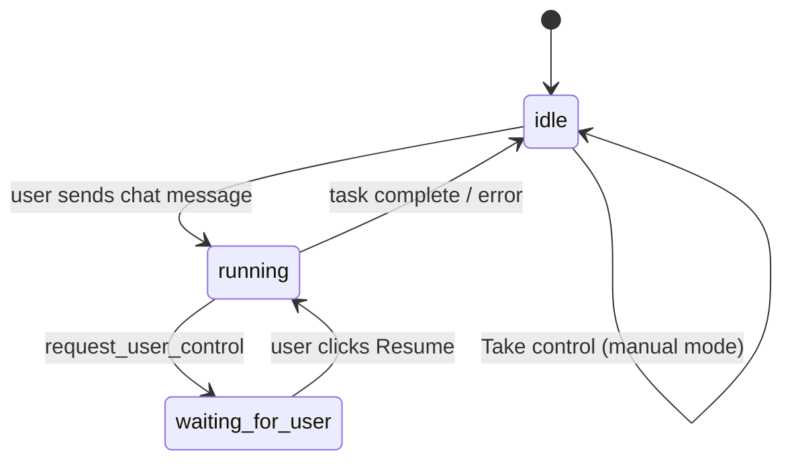
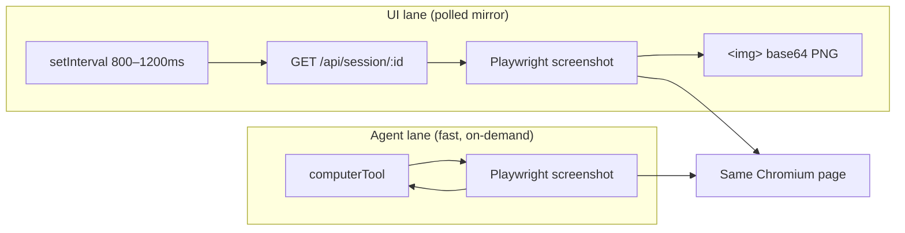
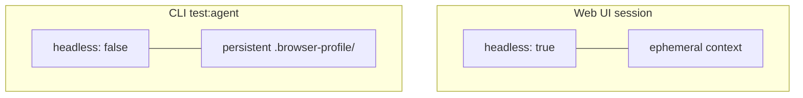

# Synchronicity · Syncro v1

> **Research & testing sandbox** for AI-driven browser automation — built on the [OpenAI Agents SDK](https://openai.github.io/openai-agents-js/) computer-use pattern and Playwright.

Syncro v1 is not a production product yet. It is a working prototype to explore how an agent can operate a real browser, when to hand control to a human, and how to mirror that browser back into a web UI.

```
┌─────────────────────────────────────────────────────────────────┐
│  SYNCRO V1 — scope                                             │
│  ✓ Agent sees browser via screenshots (SDK computer tool)      │
│  ✓ Playwright drives clicks, typing, scroll, navigation        │
│  ✓ Human-in-the-loop for CAPTCHAs and login walls              │
│  ✓ Web workspace + CLI test harness                            │
│  ✗ Real-time video stream (v1 uses polled PNG mirrors)         │
│  ✗ Multi-user / cloud browser hosting                          │
└─────────────────────────────────────────────────────────────────┘
```

---

## What Syncro v1 does

| Mode | Purpose |
|------|---------|
| **Web workspace** (`/workspace`) | Chat with the agent, watch a live-ish browser mirror, take manual control, resume after HITL |
| **CLI agent test** (`test/test-agent.ts`) | Headed browser + persistent profile — best for debugging agent behavior and bot detection |
| **CLI computer test** (`test/test-computer.ts`) | Smoke-test Playwright launch + screenshot capture |

The agent receives tasks in natural language, takes screenshots, decides actions, and loops until the task is done or it needs a human.

---

## Architecture

### High-level system



### Agent loop (SDK computer use)

This is the **original OpenAI approach** — the model does not read HTML; it sees PNG screenshots and returns tool calls.



### Human-in-the-loop (HITL)

When the agent hits a CAPTCHA, login wall, or “unusual traffic” page, it calls `request_user_control` and pauses.



**Web UI flow**

1. Agent pauses → status becomes `waiting_for_user`
2. You click the browser mirror, type/scroll directly on the page
3. You press **Resume agent** in chat
4. Agent takes a fresh screenshot and continues

**CLI flow**

1. Agent prints a reason in the terminal
2. You solve the block in the **headed** browser window
3. You press **Enter** in the terminal to hand control back

### UI mirror vs agent vision (important)

Syncro v1 uses **two different screenshot paths**:



| Lane | When | Notes |
|------|------|-------|
| **Agent** | Every model step | Full resolution, drives automation |
| **UI** | Poll while idle / manual control | Throttled (~900ms), **skipped while agent is `running`** |

This is why the workspace can feel laggy or frozen during agent runs — v1 prioritizes correctness over a live stream.

---

## Tech stack

| Layer | Choice |
|-------|--------|
| Monorepo | Turborepo + npm workspaces |
| App | Next.js 16 (App Router) |
| Agent | `@openai/agents` + `computerTool` |
| Browser | Playwright (Chromium) |
| UI | React 19, Tailwind 4, shadcn/base-ui |
| Language | TypeScript |

---

## Project structure

```
Synchronicity/
├── apps/web/                    # Syncro v1 application
│   ├── app/
│   │   ├── page.tsx             # Landing page
│   │   ├── workspace/           # Main workspace UI
│   │   └── api/session/         # Session + chat + control APIs
│   ├── components/workspace/
│   │   ├── workspace-shell.tsx  # Layout, polling, session boot
│   │   ├── browser-panel.tsx    # Screenshot mirror + manual input
│   │   └── chat-panel.tsx       # Agent chat + resume
│   ├── lib/agent/
│   │   ├── computer.ts          # PlaywrightComputer (SDK Computer iface)
│   │   ├── agent.ts             # Browser agent + instructions
│   │   ├── tools.ts             # navigate + request_user_control
│   │   ├── session.ts           # In-memory sessions + task runner
│   │   └── control.ts           # Viewport mapping for UI clicks
│   └── test/
│       ├── test-agent.ts        # CLI full agent run
│       └── test-computer.ts     # CLI screenshot smoke test
└── packages/                    # Shared eslint + tsconfig (monorepo)
```

---

## Getting started

### Prerequisites

- **Node.js** ≥ 24
- **OpenAI API key** with access to the models used by `@openai/agents`
- Playwright Chromium (installed automatically with `playwright` npm package)

### 1. Install

```bash
git clone <repo-url>
cd Synchronicity
npm install
```

### 2. Configure API key

```bash
cp apps/web/.env.example apps/web/.env.local
# Edit apps/web/.env.local and set:
# OPENAI_API_KEY=sk-...
```

### 3. Run the web workspace

```bash
cd apps/web
npm run dev
```

Open [http://localhost:3000](http://localhost:3000) → **Get started** → `/workspace`.

### 4. Run CLI tests (research / debugging)

```bash
cd apps/web

# Full agent task (headed browser, persistent profile, keeps window open)
npm run test:agent

# Screenshot-only smoke test (writes test-screenshot.png)
npm run test:computer
```

Or from the monorepo root:

```bash
npm run dev --workspace=@repo/web
```

---

## API reference (v1)

| Method | Path | Description |
|--------|------|-------------|
| `POST` | `/api/session` | Create or reuse session; launches headless browser |
| `GET` | `/api/session/:id` | Poll snapshot (status, messages, screenshot, URL) |
| `DELETE` | `/api/session/:id` | Close session and browser |
| `POST` | `/api/session/:id/chat` | Send user message; starts agent task |
| `POST` | `/api/session/:id/resume` | Resume after HITL pause |
| `POST` | `/api/session/:id/control` | Manual click / type / key / scroll |

Sessions are stored **in memory** on the server — restarting `next dev` clears them.

---

## Agent tools (v1)

| Tool | Role |
|------|------|
| `computer` (SDK) | Screenshot, click, type, scroll, keypress |
| `navigate` | Direct URL navigation (skips search when URL is known) |
| `request_user_control` | Pause for human help (CAPTCHA, login, bot walls) |

---

## Browser modes



| | Web UI | CLI |
|---|--------|-----|
| Headless | Yes | No (visible window) |
| Profile | Ephemeral (no shared lock) | Persistent (cookies, less bot friction) |
| After task | Session stays until End session | `keepOpen()` until Enter |

---

## Known limitations (v1)

These are intentional tradeoffs for a research build:

- **Polled UI mirror** — not WebSocket/CDP screencast; 800–1200ms refresh
- **Frozen preview during agent runs** — UI screenshots pause while `status === "running"`
- **Single server session** — `getOrCreateSession` reuses one in-memory session
- **Headless web UI** — CAPTCHAs are harder than in headed CLI mode
- **No auth, no persistence** — chat history lives in server RAM only
- **Large payloads** — full PNG base64 embedded in JSON poll responses

---

## Research questions Syncro v1 explores

1. Can the OpenAI Agents SDK `computerTool` + Playwright replace a custom action loop?
2. When should the agent call `request_user_control` vs retry?
3. How usable is a **screenshot mirror** for manual control (coordinate mapping at 1280×800)?
4. What is the minimum API surface for session + chat + control?
5. What UX gap exists between **polled PNGs** and **live screencast** (Browser Use, agent-browser, etc.)?

---

## Roadmap (post-v1)

Not implemented yet — documented for direction:

| Priority | Improvement |
|----------|-------------|
| High | WebSocket + CDP `Page.startScreencast` for live preview |
| High | UI frames during agent `running` state |
| Medium | Separate `/frame` endpoint; JPEG preview vs agent PNG |
| Medium | Session persistence / multi-tab |
| Low | Hosted browser (Browserbase, Steel) for production |

---

## Scripts

| Command | Location | Description |
|---------|----------|-------------|
| `npm run dev` | `apps/web` | Start Next.js dev server |
| `npm run test:agent` | `apps/web` | CLI agent integration test |
| `npm run test:computer` | `apps/web` | CLI Playwright screenshot test |
| `npm run dev` | root | Turbo dev (all workspaces) |
| `npm run build` | root | Turbo build |

---

## License

Private / research — see repository settings.

---

<p align="center">
  <strong>Synchronicity · Syncro v1</strong><br>
  <sub>Testing & research — screenshot-based browser agents with human-in-the-loop</sub>
</p>
